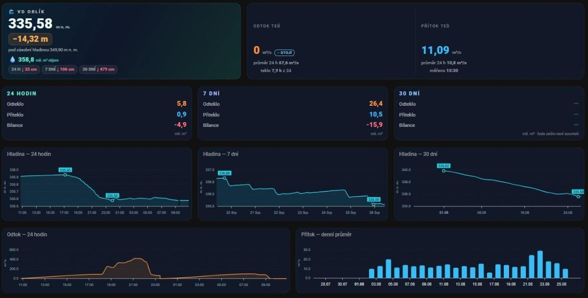

# VD Orlík pro Home Assistant

Hladina, přítok a odtok Orlické přehrady přímo v Home Assistantu — včetně denní
a týdenní bilance a historie za posledních 30 dní.



> **Není to oficiální aplikace Povodí Vltavy.** Data pocházejí z jejich veřejného
> portálu, ale za jejich zpracování ani dostupnost neručí. Pro rozhodování
> o bezpečnosti, plavbě nebo při povodni používejte oficiální zdroje —
> [Povodí Vltavy](https://www.pvl.cz/), [ČHMÚ](https://www.chmi.cz/) a HZS.

---

## Co to umí

| Co uvidíte | Odkud to je |
|---|---|
| Hladina, objem, okamžitý přítok a odtok | přímo z měření Povodí Vltavy |
| Rezerva do zásobní hladiny (349,90 m n. m.) | dopočítané |
| Změna hladiny za 24 h, 7 a 30 dní | z archivu měření |
| Kolik vody za období přiteklo, odteklo a jaká je bilance | integrace měřené řady |
| Průměrný odtok za 24 h a kolik hodin se opravdu pouštělo | dopočítané |
| Denní a týdenní rozpad za posledních 35 dní | dopočítané |

Poslední řádek stojí za vysvětlení. Orlík jede **špičkově** — odtok je většinu dne
přesná nula a pak se pár hodin pouští přes 400 m³/s. Okamžitá hodnota odtoku proto
o provozu skoro nic neřekne, a právě proto integrace hlásí i průměr za 24 hodin
a počet hodin, kdy voda skutečně tekla.

## Odkud data tečou

```
portál Povodí Vltavy  ──►  GitHub Actions (1× za 30 min)  ──►  orlik.json
                                                                   │
                                       vaše instalace Home Assistanta
```

Data se z pvl.cz stahují **jednou centrálně** pro všechny. Vaše instalace chodí
na statický JSON, ne na jejich web — ať už integraci používá deset lidí nebo tisíc,
Povodí Vltavy vidí pořád jednoho klienta.

Má to i druhou výhodu: **historii dostanete hned.** Denní a týdenní grafy jsou plné
od první minuty, nemusíte čekat měsíc, než si je instalace nasbírá sama.

Pokud si chcete sbírat data po svém, v nastavení integrace se dá adresa zdroje
přepsat na vlastní.

## Instalace

### 1. Integrace přes HACS

1. V HACS otevřete **⋮ → Vlastní repozitáře** (Custom repositories)
2. Vložte `https://github.com/sirbilly765/vd-orlik`, typ **Integration**
3. Najděte **VD Orlík**, dejte Stáhnout a restartujte Home Assistant
4. **Nastavení → Zařízení a služby → Přidat integraci → VD Orlík**
5. Výchozí hodnoty stačí, jen potvrďte

Vytvoří se zařízení *VD Orlík* s entitami `sensor.vd_orlik_*`.

<details>
<summary>Instalace bez HACS</summary>

Zkopírujte složku `custom_components/vd_orlik` do svého `config/custom_components/`,
restartujte Home Assistant a integraci přidejte přes Nastavení → Zařízení a služby.
</details>

### 2. Dashboard (nepovinné)

Entity se dají použít v libovolných kartách. Pokud chcete dashboard z obrázku
nahoře, jsou v [`dashboard/`](dashboard/) hotové pohledy k vložení.

Nejdřív si z HACS doinstalujte karty, které používají:

| Karta | Potřebuje ji |
|---|---|
| [apexcharts-card](https://github.com/RomRider/apexcharts-card) | všechny grafy |
| [button-card](https://github.com/custom-cards/button-card) | hlavička, souhrny, stavový řádek |
| [card-mod](https://github.com/thomasloven/lovelace-card-mod) | vzhled karet |
| [layout-card](https://github.com/thomasloven/lovelace-layout-card) | jen pohled pro počítač |

Potom v dashboardu **⋮ → Upravit dashboard → ⋮ → Editor v nezpracovaném formátu**
a obsah souboru přidejte do seznamu `views:`.

- [`vd-orlik-pc.yaml`](dashboard/vd-orlik-pc.yaml) — mřížka pro velkou obrazovku
- [`vd-orlik-mobil.yaml`](dashboard/vd-orlik-mobil.yaml) — jeden sloupec pro telefon

## Entity

| Entita | Jednotka | Co znamená |
|---|---|---|
| `sensor.vd_orlik_hladina` | m n. m. | výška hladiny |
| `sensor.vd_orlik_objem` | mil. m³ | objem nádrže |
| `sensor.vd_orlik_pritok` / `_odtok` | m³/s | okamžité hodnoty |
| `sensor.vd_orlik_rezerva_zasobni` | m | kolik chybí do zásobní hladiny |
| `sensor.vd_orlik_cas_mereni` | čas | kdy Povodí Vltavy naposledy měřilo |
| `sensor.vd_orlik_delta_hladina_24h` / `_7d` / `_30d` | cm | o kolik hladina stoupla nebo klesla |
| `sensor.vd_orlik_odtok_24h` / `_7d` / `_30d` | mil. m³ | kolik vody odteklo |
| `sensor.vd_orlik_pritok_24h` / `_7d` / `_30d` | mil. m³ | kolik vody přiteklo |
| `sensor.vd_orlik_bilance_24h` / `_7d` / `_30d` | mil. m³ | rozdíl, tedy o kolik nádrž nabrala nebo ubyla |
| `sensor.vd_orlik_odtok_prumer_24h` | m³/s | průměrný odtok za den |
| `sensor.vd_orlik_odtok_hodin_24h` | h | kolik hodin z 24 se pouštělo |
| `sensor.vd_orlik_denni_data` | dní | počet dnů; rozpad je v atributu `dny` |
| `sensor.vd_orlik_tydenni_data` | týdnů | počet týdnů; rozpad je v atributu `tydny` |
| `sensor.vd_orlik_data` | — | souhrn: `ok` / `chyba`, celá odpověď v atributech |
| `binary_sensor.vd_orlik_data_aktualni` | — | zapnuto, dokud jsou data čerstvá |
| `binary_sensor.vd_orlik_odtok_tece` | — | zapnuto, když se právě pouští |

### Na co se hodí `binary_sensor.vd_orlik_odtok_tece`

Orlík jede špičkově. Tahle entita se zapne ve chvíli, kdy se začne pouštět,
takže se na ni dá pověsit automatizace:

```yaml
automation:
  - alias: "Orlík začal pouštět"
    triggers:
      - trigger: state
        entity_id: binary_sensor.vd_orlik_odtok_tece
        from: "off"
        to: "on"
    actions:
      - action: notify.mobile_app
        data:
          message: >-
            Orlík pouští {{ states('sensor.vd_orlik_odtok') }} m³/s.
```

## Známá omezení

Dashboard se instaluje ručně a potřebuje čtyři karty z HACS — to je zatím
nejpracnější část. Kdo si vystačí s vlastními kartami, entity fungují samy
o sobě a nic dalšího instalovat nemusí.

Integrace se přidává přes „Vlastní repozitáře" v HACS, protože zatím není
v jeho výchozím seznamu.

## Jak přesná ta čísla jsou

**Odtok je spolehlivý.** Povodí Vltavy zveřejňuje měření po deseti minutách, takže
i špičkový provoz se integruje přesně.

**Přítok a bilance jsou odhad.** Počítají se z rozdílu objemu, a ten portál hlásí
po skocích zhruba 0,15 mil. m³, což odpovídá jednomu centimetru hladiny. U vydatných
dnů se ta nepřesnost ztratí, u klidných může být i desetina hodnoty. Proto se čísla
zobrazují na jedno desetinné místo — víc by předstíralo přesnost, kterou nemají.

Objem se z řady čte proložením přímkou přes okno ±60 minut, což kvantování průměruje.
Proti prostému „nejbližšímu vzorku" to snížilo šum v denním přítoku o zhruba třetinu.

## Co je v repozitáři

| Složka | K čemu je |
|---|---|
| `custom_components/vd_orlik/` | **samotná integrace** — jediné, co se instaluje do Home Assistanta |
| `dashboard/` | dva hotové dashboardy a návod k nim |
| `docs/` | publikovaná data — `orlik.json` a archiv měření, servíruje je GitHub Pages |
| `tools/` | sběrač dat — běží **jen v GitHub Actions v tomto repozitáři**, viz níž |
| `tests/` | testy — `test_parser.py` (jednotkové, offline, k pokrytí `tools/vd_orlik_parser.py`) + `test_e2e.py` a `test_vd_orlik.py` (integrace Home Assistanta) |

### Proč je `tools/` mimo integraci

`tools/vd_orlik_parser.py` je ten kus, který chodí na portál Povodí Vltavy, stahuje
měření a počítá z nich denní a týdenní statistiky. **Záměrně leží mimo
`custom_components/`, aby ho HACS nikdy nenainstaloval do cizího Home Assistanta.**
Spouští ho jedině plánovaná úloha v tomto repozitáři a výsledek publikuje jako
statický JSON. Vaše instalace čte hotová data a na pvl.cz nechodí.

Ve workflow je navíc podmínka `if: github.repository == 'sirbilly765/vd-orlik'`,
takže se sběr nespustí ani v kopii (forku) tohoto repozitáře.

`tools/vd_orlik_ca.pem` je běžný balík kořenových certifikátů. Server Povodí Vltavy
posílá neúplný řetěz, takže se ověření podpisu bez něj na některých systémech
nepovede. Nejsou to žádné klíče ani přihlašovací údaje — jen veřejné certifikáty,
stejné, jaké má v sobě každý prohlížeč.

### Testování

Jednotkové testy parseru nepotřebují Home Assistanta ani síť:

```bash
python3 -m pytest tests/test_parser.py -q --confcutdir=tests
```

Pokrývají parsování čísel a dat, sloučení a retenci cache, hledání nejbližšího
vzorku, interpolaci objemu, lichoběžníkovou integraci odtoku, hodiny s odtokem,
denní a týdenní agregační rozpad i rozbor HTML tabulek — včetně DST regrese, kdy
porovnání ISO řetězců přes časovou zónu způsobovalo špatné řazení vzorků v den
zpětného překlopení hodin. Testy integrace (Home Assistant) běží samostatně.

## Kdo to platí

Provoz projektu — sběr dat i jeho publikování — podporuje **[Tvrz Holešice](https://www.tvrzholesice.cz)**,
rekreační areál u Orlické přehrady. Díky tomu je integrace zdarma a bez reklam.

## Poděkování a licence

Data pocházejí z veřejného portálu **Povodí Vltavy, s. p.** Děkujeme, že je zveřejňují.

Kód je pod licencí MIT, viz [LICENSE](LICENSE). Data samotná pod licenci tohoto
projektu nespadají — jejich autorem je Povodí Vltavy, s. p.

Chyby a nápady patří do [Issues](https://github.com/sirbilly765/vd-orlik/issues).
